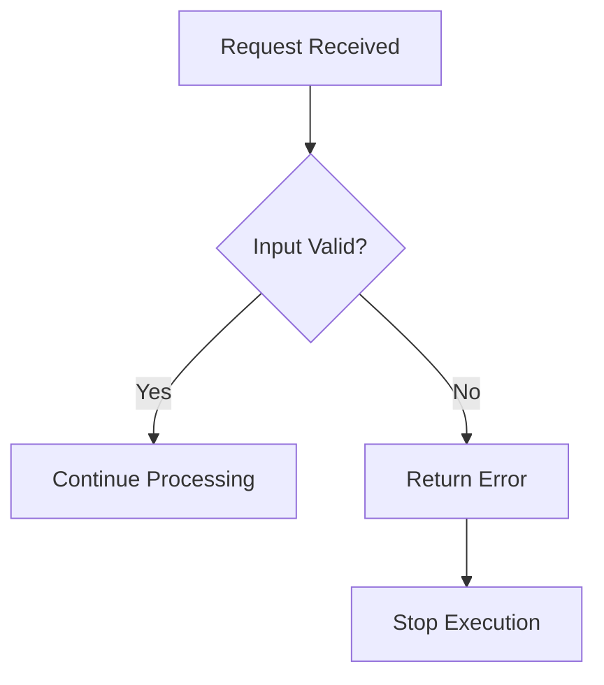
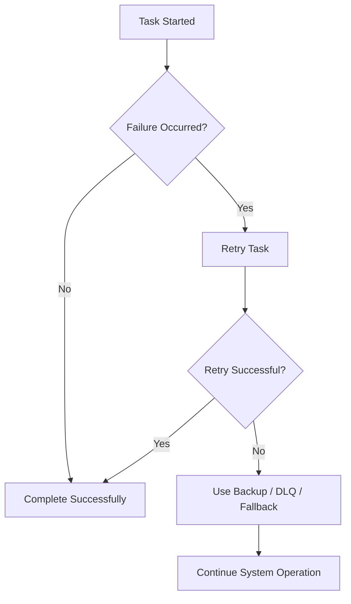

# Fail Fast vs Fail Safe Design

> **Module:** Fault Tolerance
> **Task:** T10 - Fail Fast vs Fail Safe Design

---

# Table of Contents

* [Introduction](#introduction)
* [What is Fail Fast?](#what-is-fail-fast)
* [What is Fail Safe?](#what-is-fail-safe)
* [Flowcharts](#flowcharts)
* [Comparison Table](#comparison-table)
* [Advantages and Disadvantages](#advantages-and-disadvantages)
* [Real-World Examples](#real-world-examples)
* [IntelliView Example](#intelliview-example)
* [Relationship with Fault Tolerance](#relationship-with-fault-tolerance)
* [Conclusion](#conclusion)
* [References](#references)

---

# Introduction

Software systems are expected to operate reliably even when unexpected failures occur. To achieve this, software architects adopt different failure-handling strategies depending on the application's requirements.

Two widely used design philosophies are:

* **Fail Fast**
* **Fail Safe**

Although both deal with failures, they have different goals.

* **Fail Fast** stops execution immediately after detecting an error.
* **Fail Safe** attempts to recover from failures while keeping the application operational.

Modern distributed systems typically use **both** approaches together.

---

# What is Fail Fast?

Fail Fast is a software design philosophy where an application immediately stops processing when it detects an invalid condition or unexpected error.

Instead of continuing with potentially incorrect data, the system raises an error as early as possible.

## Definition

> **Fail Fast is the practice of detecting errors immediately and terminating execution before the system enters an invalid state.**

### Objectives

* Detect bugs early
* Prevent data corruption
* Simplify debugging
* Improve software reliability

### Example

A user submits a registration form without an email address.

Instead of creating an incomplete account, the application immediately returns an error indicating that the email field is required.

---

# What is Fail Safe?

Fail Safe is a design philosophy where the system attempts to continue functioning despite failures.

Instead of stopping completely, it uses retries, backup mechanisms, or fallback logic to maintain service availability.

## Definition

> **Fail Safe is the practice of handling failures gracefully while allowing the system to continue operating whenever possible.**

### Objectives

* Maximize system availability
* Improve user experience
* Recover automatically from temporary failures
* Increase overall reliability

### Example

If a recommendation service becomes unavailable, an e-commerce website displays popular products instead of showing an error page.

---

# Flowcharts

## Fail Fast Workflow



The system immediately terminates processing once an invalid condition is detected.

---

## Fail Safe Workflow



Instead of stopping completely, the system attempts recovery before declaring failure.

---

# Comparison Table

| Feature         | Fail Fast                        | Fail Safe                                    |
| --------------- | -------------------------------- | -------------------------------------------- |
| Goal            | Detect errors immediately        | Continue operating after failures            |
| Error Handling  | Stop execution                   | Recover gracefully                           |
| User Experience | Operation stops                  | Service continues                            |
| Availability    | Lower                            | Higher                                       |
| Debugging       | Easier                           | More difficult                               |
| Complexity      | Lower                            | Higher                                       |
| Data Integrity  | Very High                        | High                                         |
| Typical Usage   | Input validation, authentication | Distributed systems, cloud services, retries |

---

# Advantages and Disadvantages

## Fail Fast

### Advantages

* Detects bugs immediately
* Prevents invalid system states
* Easier debugging
* Better data integrity
* Simplifies maintenance

### Disadvantages

* Interrupts execution immediately
* Lower availability
* Temporary failures may unnecessarily stop processing

---

## Fail Safe

### Advantages

* Higher availability
* Better user experience
* Automatic recovery
* Suitable for distributed systems
* Improves reliability

### Disadvantages

* More complex implementation
* Harder debugging
* Bugs may remain hidden
* Fallback mechanisms may not provide optimal results

---

# Real-World Examples

## Fail Fast

* API rejects invalid JSON requests.
* Application refuses to start without a database connection.
* Login fails immediately for incorrect credentials.
* Compiler stops when syntax errors are detected.

---

## Fail Safe

* Netflix lowers video quality when bandwidth decreases.
* Cloud storage retries failed uploads.
* Banking applications retry payment requests after temporary network failures.
* GPS navigation recalculates the route when a road is closed.

---

# IntelliView Example

The IntelliView Interview Orchestrator is a practical example where **both Fail Fast and Fail Safe are used together**.

## Fail Fast in IntelliView

* Reject invalid interview requests.
* Stop processing if mandatory session information is missing.
* Prevent invalid API inputs from entering the system.

**Example**

```text
Candidate starts interview
        │
Missing Session ID
        │
Return HTTP Error
        │
Stop Processing
```

---

## Fail Safe in IntelliView

Background AI tasks are processed using Celery workers.

If one worker crashes while processing Video Analysis:

* Retry the task.
* Assign another healthy worker.
* If retries fail repeatedly, move the task to the Dead Letter Queue (DLQ).
* Continue processing the remaining interview tasks.

```text
Video Worker
      │
Worker Crashes
      │
Retry Task
      │
Healthy Worker Available
      │
Continue Processing
```

This prevents the entire interview session from failing because of a single worker failure.

---

# Relationship with Fault Tolerance

Fault Tolerance is the ability of a system to continue operating despite failures.

Both philosophies contribute to fault tolerance.

## Fail Fast

Used when continuing execution would produce incorrect or unsafe results.

Examples:

* Invalid API requests
* Configuration errors
* Authentication failures
* Invalid user inputs

---

## Fail Safe

Used when failures are temporary or recoverable.

Examples:

* Retry mechanisms
* Health monitoring
* Worker reassignment
* Dead Letter Queues
* Graceful shutdown
* Load balancing

Modern distributed applications typically combine both approaches.

---

# Conclusion

Fail Fast and Fail Safe are complementary software design philosophies.

Fail Fast focuses on correctness by detecting and stopping errors immediately.

Fail Safe focuses on reliability by recovering from failures and maintaining system availability.

Large-scale distributed applications such as IntelliView combine both techniques to achieve a balance between reliability, availability, performance, and data integrity.

---

# References

1. Celery Documentation – https://docs.celeryq.dev/
2. Redis Documentation – https://redis.io/docs/
3. Martin Fowler – Fail Fast Principle – https://martinfowler.com/
4. Microsoft Azure Architecture Center – Retry Pattern – https://learn.microsoft.com/azure/architecture/patterns/retry
5. Google Site Reliability Engineering (SRE) Book – https://sre.google/books/
6. Docker Documentation – https://docs.docker.com/
7. IntelliView Internal Architecture Notes (Fault Tolerance Module)
